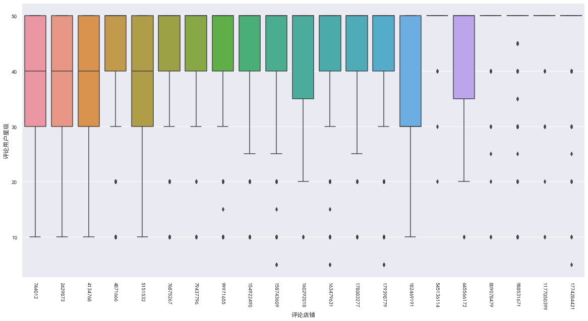
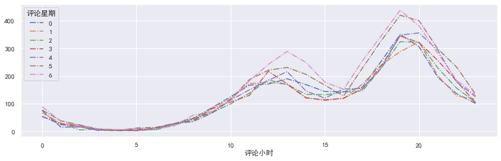

# 美团店铺评论抓取 -

## 介绍：

**涉及美团的店铺详情介绍抓取、店铺的评论抓取，以及后续的文本处理清洗，建模情感分析**

## 难点（反爬虫对抗）：

1. **cookie时效性的问题**： 爬取评论时大概爬取二十页左右，可能就出现检测信息，利用 selenium 自动登录美团，重新获取 cookies，载入到请求头中
    ``` python
    chromeoption = webdriver.ChromeOptions()
    chromeoption.add_argument(random.choice(user_agent))
    chromeoption.add_argument("--headless")
    chromeoption.add_experimental_option('excludeSwitches',
                                            ['enable-automation'])
    driver = webdriver.Chrome(executable_path=(r'chromedriver.exe'), chrome_options=chromeoption)
    driver.execute_cdp_cmd("Page.addScriptToEvaluateOnNewDocument", {
        "source": """
        Object.defineProperty(navigator, 'webdriver', {
            get: () => undefined
        })
        """
    })
    driver.get('https://passport.meituan.com/account/unitivelogin')
    time.sleep(random.randint(0,4))
    account_box = driver.find_element_by_id('login-email')
   ``` 

2. **修改请求头中浏览器信息**：使用fake_useragent第三方库，修改request中的headers参数，用法如下：

   ``` python
   from fake_useragent import UserAgent
   ua = UserAgent()
   headers = {'User-Agent':ua.random}
   ```

3. **设置跳转路径**：在访问评论时，一般的浏览行为是从某一页跳转到下一页这样的，而不是直接通过连接访问，为了更好的伪装成一个正常的访问，我们需要设置一下跳转的路径，修改headers中的Referer参数

   ``` python 
   headers = {
           'User-Agent':ua.random,
           'Cookie': cookie ,
           'Referer': 'https://wh.meituan.com/meishi/c17/'
   }
   ```

4. **使用IP代理池**：这里使用西刺代理的免费代理，构建一个爬虫爬取西刺代理的ip，然后进行验证，筛掉不可用的ip，构建出ip池供后续调用，代码来自网络。但是经过测试，大众点评对一个账号不同ip访问监控非常严格，使用IP代理池不更换账号的话，死的更快，封你账号，然而构建账号池比较麻烦，我们先暂缓。

5. **降低爬取频率**：一个简单又有效的方法就是降低爬取频率，毕竟高频率的爬取对服务器也是一个考验，如果对速度的要求不是很高的话，建议把频率放慢一点，你好我好大家好！

   ``` python
   import random
   import time
   time.sleep(6*random.random() + 4)
   ```

6. **设置断点续传**：即使降低了爬取频率，有时还是会被美团的网络工程师抓到的，小哥哥饶命啊~。因此我们需要一个断点续传的小功能，避免每次都从头开始爬。思路是建一个文本文件，存储当前爬取的进度，每次运行程序时都出当前进度开始，详见代码~

## 一、爬虫

### 整体思路

爬取武汉美团中的美食栏目下的火锅的二十家热门火锅店的详情页，每家火锅店铺的详细信息，爬取火锅店铺的详细信息后，继续抓取火锅店铺的所有评论，最后将评论信息提取出来存储到数据库中。

### 1. 构造网页爬取美团店铺的专属ID，获取商家的信息列表

链接格式为 https://wh.meituan.com/meishi/c17/，
具体页面如下图所示，


我们需要右击网页，检查源码（或者按 F12），在网络中找到 Ajax 请求，如下图所示


可以发现 链接格式为 "https://wh.meituan.com/meishi/api/poi/getPoiList?cityName=武汉&cateId=17&areaId=0&sort=&dinnerCountAttrId=&page=1&userId=625054939&uuid=b6ab093ca7c44cebac42.1631346296.1.0.0&platform=1&partner=126&originUrl=https://wh.meituan.com/meishi/c17/&riskLevel=1&optimusCode=10&\_token=eJx1T8uSokAQ/Je+StjNqwEj9iCCPAZRHER0Yg6gjYACIg24s7H/vj0R7mEPe8qsrMyMql/g4ZzBjEdIQ4gDA3mAGeCnaIoBB2jHNljkRUkRBVERMQdO/2qqzELpIzLA7EPCmFME4fNb2LL5g5dZQsXSJ/eiAqOCxH0DSB1mATml924G4ZhPK1LQPqmnp6aCjHd5AU+8AtkZ/zEB1lKFrIXh9YXJC+nfecXeYRVdcakZI+4YlSG/fhrzICeTn/lugO5StoP47SlcGhfF1rwI/c6zHMVqNN12LA8tl2MbIvtet1lNlc0iKPNTFiW6ZXSHxWHr1OokQC6EsJpAEbs+SVbnBaKqtD+Sa7G7CH6rRfe9ZiZeMJh7dRxoVq0muPHfbZmuLO+m31rzyqe3fhfsvt5ie/44Emxuzsd0PNRlLko0Mlq/i7HWhENvkz4/F1402BCNfJ2l6dfaGfZS38S61JPnqIedkV7mnblGj3Jb+ge/k30raW+bTCTrdwH9AL//AAtCmBA="，
十分繁琐的网页URL，因此我们需要拆分网页URL，可以发发现网页参数如下图所示：


我们利用python构造参数，拼接完整的网页URL，进行爬取，部分代码展示：
```python
def get_store(page, token):
    headers = {
        'user-agent': user_agent,
        'host': 'wh.meituan.com',
        'referer': 'https://wh.meituan.com/meishi/c17/pn' + str(page) + '/',
        'cookie': Cookie,
    }
    params = {
        'cityName': '武汉',
        'cateId': '17',
        'areaId': '0',
        'sort': '',
        'dinnerCountAttrId': '',
        'page': str(page),
        'userId': uu_user_id[1],
        'uuid': uu_user_id[0],
        'platform': '1',
        'partner': '126',
        'originUrl': headers['referer'],
        'riskLevel': '1',
        'optimusCode': '10',
        '_token': token
    }
    base_url = 'https://wh.meituan.com/meishi/api/poi/getPoiList?'
    try:
        response = requests.get(url=base_url, headers=headers, params=params)
        json = response.json()
        poiInfos = json.get('data').get('poiInfos')
        for info in poiInfos:
            del info['dealList']
            store_list.append(info)
    except Exception as e:
        print('爬取第 %s 页商铺信息出错'%page)
```

这样可以获得所有店铺的详细信息。

### 2. 通过店铺ID，获取店铺的评论信息
第一步可以爬取到每个商家的专属ID，例如 六婆串串香 这家店，点击商家详情，可以发现网页跳转到 https://wh.meituan.com/meishi/5151532/ 其中 5151532 就属于这家店铺的专属ID，这一信息通过上一步爬取已经获得，利用专属ID可以拼接URL，得到每家商铺的网址，由此可以爬取每家店铺的评论信息。
部分代码展示如下：

```python
def store_comment(poiid, page, cookie):
    headers = {
        'user-agent': random.choice(user_agents),
        'host': 'wh.meituan.com',
        'referer': 'https://wh.meituan.com/meishi/%s/'%poiid,
        'cookie': cookie,
    }
    store_url = 'https://wh.meituan.com/meishi/api/poi/getMerchantComment?'
    params = {
        'uuid': 'f24c05a9c0d8464490b0.1630861808.1.0.0',
        'platform': '1',
        'partner': '126',
        'originUrl': 'https://wh.meituan.com/meishi/' + str(poiid) + '/',
        'riskLevel': '1',
        'optimusCode': '10',
        'id': str(poiid),
        'userId': '625054939',
        'offset': str(page*10),
        'pageSize': '10',
        'sortType': '1',
    }
    try:
        response = requests.get(url=store_url, headers=headers, params=params)
        json = response.json()
        comments = json.get('data').get('comments')
        for comment in comments:
            person = {}
            person['评论店铺'] = poiid
            person['评论用户姓名'] = comment['userName']
            person['评论用户id'] = comment['userId']
            person['评论用户星级'] = comment['star']
            person['评论用户菜品'] = comment['menu']
            person['评论用户内容'] = illegal_char.sub(r'', comment['comment'])
            person['评论用户内容'] = remove_emoji(person['评论用户内容'])
            person['评论时间'] = comment['commentTime']
            connect_mysql.save_data(person)
        time.sleep(random.randint(0,8))
    except Exception as e:
         return '出错'
```

### 3. 连接数据库将数据保存到数据库中

我们使用MYSQL数据库，安装教程参考[菜鸟教程](http://www.runoob.com/mysql/mysql-install.html)，python连接MYSQL数据推荐使用pymysql，同样是推荐菜鸟教程[菜鸟教程](http://www.runoob.com/python3/python3-mysql.html)。我们需要先建立一个数据库和表，然后连接并定义游标，然后写对应的sql语句，最后执行事务，存储部分的代码如下：

``` python
#连接MYSQL数据库
config = {
          'host':'localhost',
          'port':3306,
          'user':'root',
          'password':'',
          'database':'data',
          'charset':'utf8mb4',
        }
db = pymysql.connect(**config)
cursor = db.cursor()

#在数据库建表
def creat_table():
    cursor.execute("DROP TABLE IF EXISTS meituan")
    sql = '''CREATE TABLE meituan(
            评论店铺  varchar(100),
            评论用户姓名 varchar(100),
            评论用户id varchar(100),
            评论用户星级 varchar(55),
            评论用户菜品 varchar(100),
            评论用户内容 text(5000),
            评论时间 varchar(55)
            );'''
    cursor.execute(sql)
    return
```


## 二、探索性分析与文本数据预处理

### 探索性分析

1. 查看数据大小以及基础信息 ，浏览数据
    详情见代码

2. 样本分布
    详情见代码

3. 各店铺评分分布
    

4. 点评数的的时间分布

   

### 数据预处理

1. **去除非文本数据**：可以看出，爬虫获取的数据非常多类似“\xa0”的非文本数据，而且都还有一些无意义的干扰数据，如结尾的“收起评论” 

   ``` python
   #首先利用 strip() 函数删除数据前后的空格
   meituan['评论用户内容'] = meituan['评论用户内容'].str.strip()
   ```

2. **中文分词**：中文文本数据处理，怎么能离开中文分词呢，我们使用jieba库，简单又好用。这里我们把文本字符串处理为以空格区隔的分词字符串 
   ``` python
   #中文分词
   import jieba
   meituan['评论用户内容'] = meituan['评论用户内容'].apply(lambda x: ' '.join(jieba.cut(x)))
   #其次利用隐函数删除文本中的空格 换行符
   # 正则中 /s 代表匹配任何空白字符，包括空格、制表符、换页符等等。等价于 [ \f\n\r\t\v]。注意 Unicode 正则表达式会匹配全角空格符。
   meituan['评论用户内容'].replace('\s+','',regex=True,inplace=True)
   ```

3. **去除停用词**：文本中有很多无效的词，比如“着”，“和”，还有一些标点符号，这些我们不想在文本分析的时候引入，因此需要去掉，因为wordcloud和TF-IDF都支持停用词，因此就不额外处理了 

### 词云展示


## 三、情感分析

### 文本特征提取（TF-IDF）

模型不能直接处理文本数据，因此需要先把文本数据转为向量，方法有词库表示法、TF-IDF、word2vec等

``` python
#使用TF-IDF进行文本转向量处理
from sklearn.feature_extraction.text import TfidfVectorizer
tv = TfidfVectorizer(stop_words=stopwords, max_features=3000, ngram_range=(1,2))
tv.fit(x_train)
```

### 机器学习建模

这里我们使用文本分类的经典算法朴素贝叶斯算法，而且朴素贝叶斯算法的计算量较少。特征值是评论文本经过TF-IDF处理的向量，标签值评论的分类共两类，好评是1，差评是0。情感评分为分类器预测分类1的概率值。 

``` python
#计算分类效果的准确率
from sklearn.naive_bayes import MultinomialNB
from sklearn.metrics import roc_auc_score, f1_score
classifier = MultinomialNB()
classifier.fit(tv.transform(x_train), y_train)
classifier.score(tv.transform(x_test), y_test)

>>>0.9275308869629356
```

可以看出，准确率非常不错的样子 

``` python
#从美团网找两条评论来测试一下
test1 = '菜品种类超级多，熟食很多，水果饮料鲜榨种类很丰富，环境也蛮好的，就是进去的时候门不大好找！肉类品种很丰富，还有最爱的小龙虾，就是刚上五分钟就抢没了～盘子收的很勤快，服务态度也好，还有工作人员让我提意见，哈哈，我这个憨憨直说水果不甜...' #5星好评
test2 = '这不是欺骗顾客吗，根本没有龙虾，更气的是每个服务员都说有，让人白等！ ！欺骗顾客！没有就应该早点讲！ ！' #1星差评
print('好评实例的模型预测情感得分为{}\n差评实例的模型预测情感得分为{}'.format(ceshi(classifier,test1),ceshi(classifier,test2)))

好评实例的模型预测情感得分为0.6808873012465957
差评实例的模型预测情感得分为0.42542752977565185
```

我们发现美团上，5星好评模型预测出来了，1星差评预测不是十分明显。所以我们查看一下**混淆矩阵** 

```
from sklearn.metrics import confusion_matrix
y_predict = classifier.predict(tv.transform(x_test))
cm = confusion_matrix(y_test, y_predict)
cm

array([[ 467,  784],
       [ 181, 3973]], dtype=int64)
```

可以看出，**负类的预测非常不准**，433单准确预测为负类的只有15.7%，应该是由于**数据不平衡**导致的，模型的默认阈值为输出值的中位数。比如逻辑回归的输出范围为[0,1]，当某个样本的输出大于0.5就会被划分为正例，反之为反例。在数据的类别不平衡时，采用默认的分类阈值可能会导致输出全部为正例，产生虚假的高准确度，导致分类失败。

处理样本不均衡问题的方法，首先可以选择调整阈值，使得模型对于较少的类别更为敏感，或者选择合适的评估标准，比如ROC或者F1，而不是准确度（accuracy）。另外一种方法就是通过采样（sampling）来调整数据的不平衡。其中欠采样抛弃了大部分正例数据，从而弱化了其影响，可能会造成偏差很大的模型，同时，数据总是宝贵的，抛弃数据是很奢侈的。另外一种是过采样，下面我们就使用过采样方法来调整。

### 样本数据不平衡

最简单的过采样方法，就是简单复制法。但单纯的重复了反例，会过分强调已有的反例。如果其中部分点标记错误或者是噪音，那么错误也容易被成倍的放大。因此最大的风险就是对反例过拟合。 

``` python
#把0类样本复制10次，构造训练集
index_tmp = y_train==0
y_tmp = y_train[index_tmp]
x_tmp = x_train[index_tmp]
x_train2 = pd.concat([x_train,x_tmp,x_tmp,x_tmp,x_tmp,x_tmp,x_tmp,x_tmp,x_tmp,x_tmp,x_tmp])
y_train2 = pd.concat([y_train,y_tmp,y_tmp,y_tmp,y_tmp,y_tmp,y_tmp,y_tmp,y_tmp,y_tmp,y_tmp])

#使用过采样样本(简单复制)进行模型训练，并查看准确率
clf2 = MultinomialNB()
clf2.fit(tv.transform(x_train2), y_train2)
y_pred2 = clf2.predict_proba(tv.transform(x_test))[:,1]
roc_auc_score(y_test,y_pred2)

>>>0.9049699937533463
```

查看此时的混淆矩阵

```
[ 331,  100]
[ 637, 4355]
```

可以看出，即使是简单粗暴的复制样本来处理样本不平衡问题，负样本的识别率大幅上升了，变为77%，满满的幸福感呀。还有SMOTE过采样算法，SMOTE是在局部区域通过K-近邻生成了新的反例。相较于简单的过采样，SMOTE降低了过拟合风险，但同时运算开销加大，详细请看具体代码~

### 模型评估测试

``` python
def fenxi(strings):
    strings_fenci = fenci(pd.Series([strings]))
    return float(clf.predict_proba(tv2.transform(strings_fenci))[:,1])

ceshi(clf2,'排队人太多，环境不好，口味一般')

0.015253417587460566
```

只用到了简单的机器学习，就做出了不错的情感分析效果，知识的力量真是强大呀，666~

## 四、拓展应用及后续方向

- 使用更复杂的机器学习模型如神经网络、支持向量机等
- 模型的调参
- 行业词库的构建
- 增加数据量
- 优化情感分析的算法
- 增加标签提取等
- 项目部署到服务器上，更好地分享和测试模型的效果
